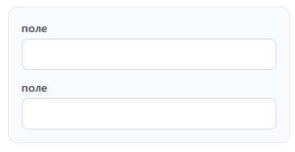
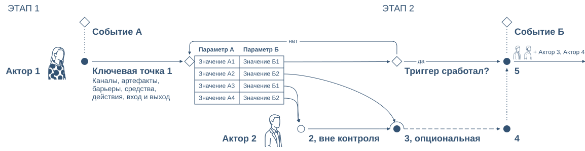
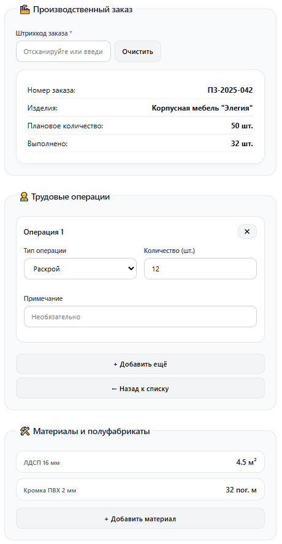
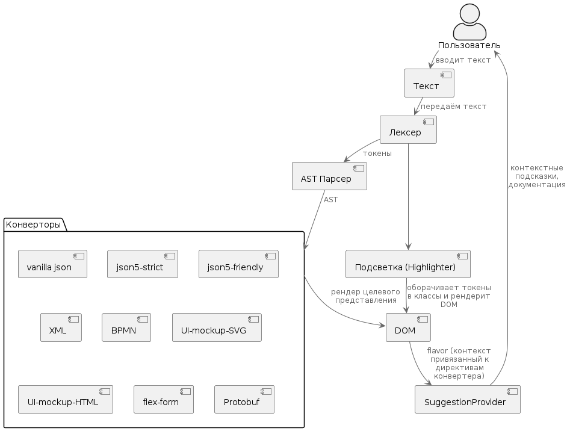
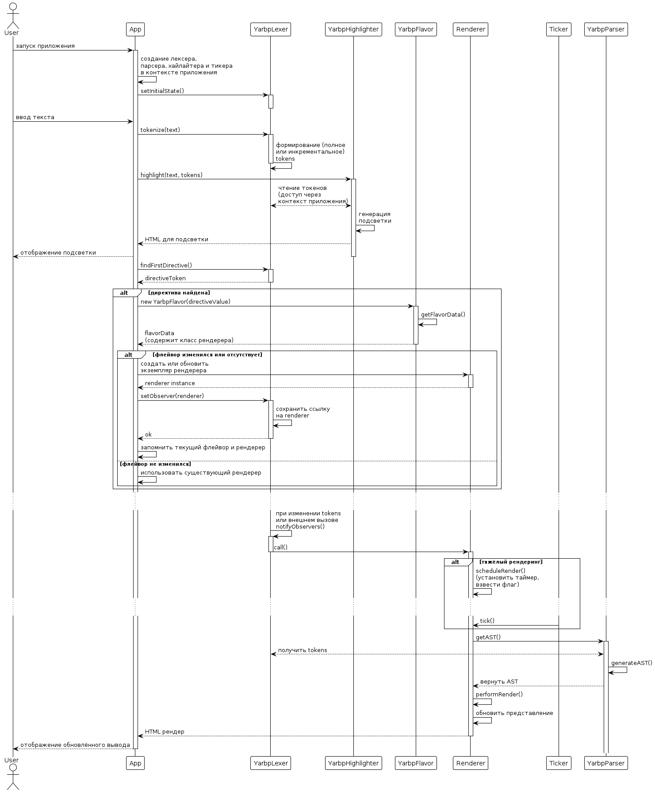

# Язык разметки для быстрого прототипирования (ЯРБП), v2.0

## Общее описание

**ЯРБП** (Язык Разметки для Быстрого Прототипирования, он же YARBP — 
"Yet Another Rapid Business Prototyping") — это язык разметки для 
аналитиков, который легко писать и читать. Сверхкомпактный, русскоязычный, 
человекочитаемый DSL.
Его главная задача — служить единым, простым источником истины, 
из которого можно автоматически сгенерировать что угодно: от макета интерфейса и схемы BPMN до JSON-конфига, Protobuf и XML.

### Идеи:
- Удобство набора (в том числе при работе в русской раскладке)
- Один синтаксис -> одно AST -> множество целевых представлений: 
  - разметка: JSON / XML / Protobuf
  - макеты UI
  - BPMN схемы
  - ...
- Широкий набор фич для максимально гибкой разметки целевых сущностей:
  - типизация
  - макросы
  - комментарии
  - директивы конвертера
  - настраиваемый сахар для объявления свойств
- Вся семантика на стороне конвертера – язык определяет только структуру, а смысл придаёт целевой конвертер.
- При этом низкий порог входа. Хотим писать просто - пишем просто, разметка валидна. Хотим писать компактно и удобно - изучаем фичи.

## Песочница
Инструмент для яэыка находится в разработке, песочница с актуальной версией:

https://yarbp.tech/

## Спецификация

### Синтаксис

#### Простой пример
```
! как форма
форма
  поле
  поле
```

Директива "как" / "as" - общая директива, указывающей какой конвертер использовать.

Отступы опеделяют иерархию элементов.

Рендер:



#### Расширенный пример

```
! as json
:
  .order_id 12345
  .status "new"
  .is_active yes
  :client .first_name Jack .last_name White .id '54312'
  ..items
    : .sku ART-001 .price 1299.99
```

Лидирующие символы указывают на тип ключа. 
В предыдущем примере типы ключей выводились автоматически, но их можно указывать явно.
Доступные типы ключей:
- лидирующая точка -> ключ примитивного значения (атрибут объекта)
- лидирующее двоеточие -> ключ объекта
- лидирующая двойная точка -> ключ массива

Указание типа ключа без значения ключа объявляет анонимное значение (значение без имени), 
см. ниже как сконвертировалось в этом примере корневой объект и объект внутри "items"

Рендер:
```json
{
  "order_id": 12345,
  "status": "new",
  "is_active": true,
  "client": {
    "first_name": "Jack",
    "last_name": "White",
    "id": "54312"
  },
  "items": [
    {
      "sku": "ART-001",
      "price": 1299.99
    }
  ]
}
```
#### Пример с типизацей и комментариями

```
! as proto
Order
  .order_number:string --- comment
  .date:string --- comment
  ..items
    Product .name:string
      .size:enum UNSPECIFIED SMALL MEDIUM LARGE
    .position:int32
```

ЯРБП поддерживает комментарии и типизацию значений. 
Типы указываются после ключей через двоеточие как ```ключ:тип```.

Комментарии начинаются с ```---```.

Рендер:
```proto
message Order {
  string order_number = 1;  // comment
  string date = 2;          // comment
  repeated Item items = 3;
}

message Product {
  string name = 1;
  Size size = 2;
}

message Item {
  Product Product = 1;
  int32 position = 2;
}

enum Size {
  UNSPECIFIED = 0;
  SMALL = 1;
  MEDIUM = 2;
  LARGE = 3;
}
```

#### Макросы.

Макросы в ЯРБП объявляются лидирующим ```@```. Используются для того чтобы минимизировать написание повторяющегося кода.
Раскрываются на уровне парсера подстановкой, т.о конвертору макросы уже недоступны, AST подается раскрытым.

Пример:
```
! as xml

@item
  .id item-(( item-number ))
  ..content
    (( variable-content ))
    extra-content .prop-1 (( prop-1 )) .prop-2 (( prop-2 ))
  controller .name controller-(( item-number ))

items
  item .item-number 1 .prop-1 1 .prop-2 2 
    ..variable-content
      sub-item .id 1
  item .item-number 2 .prop-1 3 .prop-2 4 
    ..variable-content
      sub-item .id 1
      sub-item .id 2
  item .item-number 3 .prop-1 5 .prop-2 6
    ..variable-content
```

Рендер:
```xml
<items>
  <item id="item-1">
    <content>
      <sub-item id="1"/>
      <extra-content prop-1="1" prop-2="2"/>
    </content>
    <controller name="controller-1"/>
  </item>
  <item id="item-2">
    <content>
      <sub-item id="1"/>
      <sub-item id="2"/>
      <extra-content prop-1="3" prop-2="4"/>
    </content>
    <controller name="controller-2"/>
  </item>
  <item id="item-3">
    <content>
      <extra-content prop-1="5" prop-2="6"/>
    </content>
    <controller name="controller-3"/>
  </item>
</items>
```


#### Сахар и дизайн AST.

Также существует специальный узел "shorthand", использующийся для сокращенного объявления свойств.
Для объявления сахара после имени объекта записывается знак равно.

Сахар может интерпретироваться конвертерами по их усмотрению (см. пример с динамической типизацией сахара в "Прикладной пример").

Пример 
```
! как аст
поле-формы:дата = Дата начала
```

Рендер
```json
{
  "nodeType": "ROOT",
  "directives": [
    {
      "nodeType": "DIRECTIVE",
      "value": "как аст",
      "prefix": "!",
      "position": {
        "start": 0,
        "end": 9
      }
    }
  ],
  "children": [
    {
      "nodeType": "MEANING",
      "key": "поле-формы",
      "valueType": "OBJECT",
      "prefix": "",
      "position": {
        "start": 10,
        "end": 20
      },
      "type": "дата",
      "children": [
        {
          "nodeType": "MEANING",
          "key": "shorthand",
          "prefix": ".",
          "position": {
            "start": 27,
            "end": 40
          },
          "valueType": "STRING",
          "value": "= Дата начала"
        }
      ]
    }
  ]
}
```

В этом примере разметка сконвертирована не в прикладное представление, а в AST для демонстрации дизайна AST.

#### Рендер карты процесса-опыта (КПО)

Один из конвертеров ЯРБП превращает текстовое описание бизнес-процесса
в визуальную **карту процесса-опыта**: дорожки, участники, ключевые точки,
события, таблицы решений и связи между ними.

> **Карта процесса-опыта** — метод визуализации любого хозяйственного процесса
> с акцентом на человеке, но при этом с учётом обеспечивающих его
> технических аспектов. Схема согласует пользовательский опыт и бизнес-процессы
> в единой многослойной карте: акторы и агенты, ключевые точки, линии тока,
> линии взаимодействий, триггеры, события и аннотационные блоки.
>
> — [Описание метода](https://ashapiro.ru/xpm) · [База знаний на GitHub](https://github.com/Byndyusoft/xp-mapping)

Пример разметки:
```
! как КПО

дорожка

  разделитель = ЭТАП 1
  событие = Событие А
  пусто
  пусто
  разделитель = ЭТАП 2
  событие = Событие Б 


участник = Актор 1 .картинка женщина-яркая-одежда

  точка = Ключевая точка 1
    ..связи ->
    ..аннотации
      Каналы, артефакты,
      барьеры, средства,
      действия, вход и выход

  точка 
    .ид триггер-1-2 
    .тип -<>
    таблица-решений
      ..шапка "Параметр А" "Параметр Б"
      ..правила
        :
          ..параметры "Значение А1" "Значение Б1"
          .результат точка-1-4
        :
          ..параметры "Значение А2" "Значение Б2"
          .результат точка-2-4
        :
          ..параметры "Значение А3" "Значение Б1"
          .результат точка-2-3
        :
          ..параметры "Значение А4" "Значение Б2"
          .результат точка-2-3
  
  пусто

  точка = Триггер сработал? 
    .ид точка-1-4 
    .тип -<>
    ..связи [да]-> нет нет [нет]->триггер-1-2

  точка = 5
    появление .аннотация + Актор 3, Актор 4
      ..участники
        участник .картинка производство
        участник .картинка оператор
    ..связи -> <..
  

участник = Актор 2 .картинка мужчина-менеджер
    
    пусто

    пусто

    точка = 2, вне контроля 
      .ид точка-2-3 
      .тип -о
      ..связи ->

    точка = 3, опциональная 
      .тип -( 
      .ид точка-2-4
      ..связи -->

    точка = 4
```

Рендер:



Идентификаторы иконок для использвоания в конвертере КПО:
- `мужчина`
- `женщина`
- `повар`
- `производство`
- `мужчина-в-очках`
- `женщина-в-очках`
- `в-каске`
- `ии`
- `робот`
- `мужчина-менеджер`
- `женщина-менеджер`
- `мужчина-яркая-одежда`
- `женщина-яркая-одежда`
- `оператор`

#### Прикладной пример

<details>

<summary>Если не готовы погружаться в детали - проходите дальше</summary>

Это целевой пример использования ЯРБП для генератора форм. Используются макросы, 
директивы конвертора (рендерера формы) предоставляющие типизацию сахара.

Разметка формы:
```
! как xml
! типизация-сахара(поле)  лэйбл/плейсхолдер/обязательный/постфикс
! типизация-сахара(опция) представление/значение

@ввод-показателей
  группа:плитка =     (( имя-формы ))
    .направление вертикально
    табы .ид          (( ид-табов ))
      таб#список
                      (( контент-списка ))
        кнопка =    + (( имя-кнопки-добавления ))
          .навигация #(( ид-табов )).добавить
      таб#добавить
        группа:плитка
          ..доп-функционал очистить
          надпись =   (( имя-добавляемой-сущности ))
          группа
                      (( поля-формы-ввода ))
          поле = Комментарий / что-то еще?
        кнопка = Добавить
          ..источник #добавить
          ..приемник #список
        кнопка = <- Назад к списку
          .навигация  #(( ид-табов )).список
          .проверить #(( ид-табов )).добавить.количество
          .диалог Очистите введенные данные или перенесите их в отчет / Ок
          .тип_проверки пусто
          .цель_проверки запретить


группа#производственный-отчет:форма
  группа -- левая колонка

    группа:плитка = 🏭 Производственный заказ
      .направление вертикально
      поле#запрос-заказа:штрихкод = Штрихкод заказа / Отсканируйте бланк заказа / да
        ..доп-функционал очистить
        .хук https://foobar.tech/order
      группа:таблица-соответствий
        поле:строка =  Номер заказа
        поле:строка =  Изделия
        поле:целое =   Плановое количество / / / шт.
        поле:целое =   Выполнено / / / шт.

    ввод-показателей
      .имя-формы 👷 Трудовые операции .имя-добавляемой-сущности Операция
      .ид-табов трудозатраты .имя-кнопки-добавления Добавить операцию
      контент-списка
        группа:набор-соответствий
          :поле#тип-операции
          поле#количество:целое .постфикс шт.
          поле = Комментарий:
      поля-формы-ввода
        поле:выбор = Тип операции
          .тип-данных Справочник.ВидыРаботСотрудников
          опция = Раскрой  / d9d22580-0c9f-11f1-81c8-bc241168061e
          опция = Контроль / f6f35814-12ee-11f1-862c-bc241168061e
          опция = Сборка   / 6bea020c-0297-11f1-86e5-bc241168061e
          опция = Упаковка / 3620c04c-21d8-11f1-8b34-bc241168061e
        поле:число = Количество / Укажите кол-во / *

    ввод-показателей
      .имя-формы 🛠️ Материалы и полуфабрикаты .имя-добавляемой-сущности Материал
      .ид-табов материалы .имя-кнопки-добавления Добавить материал
      контент-списка
        группа:набор-соответствий
          :поле#номенклатура
          :поле#количество
      поля-формы-ввода
        поле:штрихкод = Номенклатура // Отсканируйте ш/к // дп .хук https://foobar.tech/nomenclature
        поле:число = Количество / Укажите кол-во / да
```

Рендер формы:



</details>


#### Конвертеры

Доступные в данный момент конвертеры:
- "! as lexer" - таблица вывода токенизатора (отладочное представление лексера)
- "! as ast" - AST дерево (отладочное представление парсера, подается на вход конвертора)
- "! as ui" / "! как форма" - рендер формы (в разработке)
- "! as json" / "! как джейсон"
- "! as xml" / "! как хмл"
- "! as proto"

#### Синтаксис в PEG

```peg
; ============================================================
; ЯРБП v2.0 — PEG спецификация
; ============================================================

документ              <- элемент*
элемент               <- отступ? выражение? комментарий? CRLF
выражение             <- директива / узел+

комментарий           <- префикс-комментария [^\n]*
директива             <- префикс-директивы S? имя-директивы S значение-директивы
узел                  <- сложный-узел / примитивный-узел

сложный-узел          <- объект / массив

объект                <- ( префикс-объекта? ключ ) / ( префикс-объекта ключ? ) ( ":" тип )? ( S+ примитивный-узел )*
массив                <- ( префикс-массива? ключ ) / ( префикс-массива ключ? ) ( ":" тип )? ( S+ ( объект / значение ) )*

примитивный-узел      <- префикс-примитива ключ " " примитив
примитив              <- строка / число / булево / null
строка                <- (токен S?)+ / строка-в-кавычках

; --- Семантические определения ---
тип                   <- токен
ключ                  <- токен
имя-директивы         <- токен
значение-директивы    <- (токен S)*

; --- Префиксы ---
префикс-комментария <- "---"
префикс-директивы   <- "!"
префикс-объекта     <- ":"
префикс-массива     <- ".."
префикс-примитива   <- "."

; --- Базовые определения ---
отступ            <- [ " " ]+
токен             <- ( !"--" !S . )+
строка-в-кавычках <- "\"" .* "\"" / "'" .* "'"
число             <- "-"? [0-9]+ ("." [0-9]+)? ([eE] "-"? [0-9]+)?
булево            <- "true" / "false" / "yes" / "no" / "да" / "нет"
null              <- "null"
S                 <- [ \t\n\r]
CRLF              <- [\n\r]
```

## Реализация

### Архитектура

#### Целевая схема компонентов


#### Сиквенс текущей реализации редактора


<details>
<summary>Исходники PlantUML</summary>

```
@startuml
!include <C4/C4_Container>

skinparam ranksep 10

actor Пользователь

component "Текст" as Text
component "Лексер" as Lexer
component "AST Парсер" as ASTParser

package "Конверторы" <<Контейнер>> {
    component "json" as JSONVanilla
    component "json5-strict" as JSON5Strict
    component "json5-friendly" as JSON5Friendly
    component "XML" as XML
    component "BPMN" as BPMN
    component "UI-mockup-SVG" as SVG
    component "UI-mockup-HTML" as HTML
    component "flex-form" as FlexForm
    component "Protobuf" as Protobuf
}

component "Подсветка (Highlighter)" as Highlighter
component "DOM" as DOM
component "SuggestionProvider" as SuggestionProvider

Пользователь --> Text : вводит текст
Text --> Lexer : передаём текст
Lexer --> ASTParser : токены
Lexer --> Highlighter
ASTParser --> "Конверторы" : AST

Highlighter --> DOM : оборачивает токены в классы и рендерит DOM
DOM --> SuggestionProvider : flavor (контекст привязанный к директивам конвертера)
SuggestionProvider --> Пользователь : контекстные подсказки,\nдокументация
"Конверторы" --> DOM : "рендер целевого представления"

@enduml
```

```
@startuml
!theme plain
actor User
participant "App" as App
participant "YarbpLexer" as Lexer
participant "YarbpHighlighter" as Highlighter
participant "YarbpFlavor" as Flavor
participant "Renderer" as Renderer
participant "Ticker" as Ticker
participant "YarbpParser" as Parser

User -> App ++: запуск приложения
App -> App: создание лексера, \nпарсера, хайлайтера и тикера\nв контексте приложения

App -> Lexer: setInitialState()
activate Lexer
deactivate Lexer

User -> App: ввод текста

deactivate Lexer

App -> Lexer: tokenize(text)
activate Lexer
Lexer -> Lexer: формирование (полное \nили инкрементальное)\ntokens
deactivate Lexer

App -> Highlighter: highlight(text, tokens)
activate Highlighter
Highlighter <--> Lexer: чтение токенов \n(доступ через \nконтекст приложения)
Highlighter -> Highlighter: генерация\nподсветки
Highlighter --> App: HTML для подсветки
App --> User: отображение подсветки
deactivate Highlighter

App -> Lexer: findFirstDirective()
activate Lexer
Lexer --> App: directiveToken
deactivate Lexer

alt директива найдена
    App -> Flavor: new YarbpFlavor(directiveValue)
    activate Flavor
    Flavor -> Flavor: getFlavorData()
    Flavor --> App: flavorData \n(содержит класс рендерера)
    deactivate Flavor

    alt флейвор изменился или отсутствует
        App -> Renderer: создать или обновить \nэкземпляр рендерера
        activate Renderer
        Renderer --> App: renderer instance
        deactivate Renderer

        App -> Lexer: setObserver(renderer)
        activate Lexer
        Lexer -> Lexer: сохранить ссылку \nна renderer
        Lexer --> App: ok
        deactivate Lexer

        App -> App: запомнить текущий флейвор и рендерер
    else флейвор не изменился
        App -> App: использовать существующий рендерер
    end
end

activate Lexer
...  ...
Lexer -> Lexer ++ : при изменении tokens\nили внешнем вызове \nnotifyObservers()
Lexer -> Renderer --++: call()

alt тяжёлый рендеринг
 
    Renderer -> Renderer: scheduleRender()\n(установить таймер, \nвзвести флаг)
    ...  ...
    Ticker -> Renderer : tick()

end
      Renderer -> Parser ++ : getAST()
      Parser <--> Lexer : получить tokens
      Parser -> Parser : generateAST()
      Parser --> Renderer : вернуть AST
 
    Renderer -> Renderer: performRender()


Renderer -> Renderer: обновить представление
Renderer --> App: HTML рендер
deactivate Renderer
deactivate Lexer

App --> User: отображение обновлённого вывода
deactivate App

@enduml
```
</details>